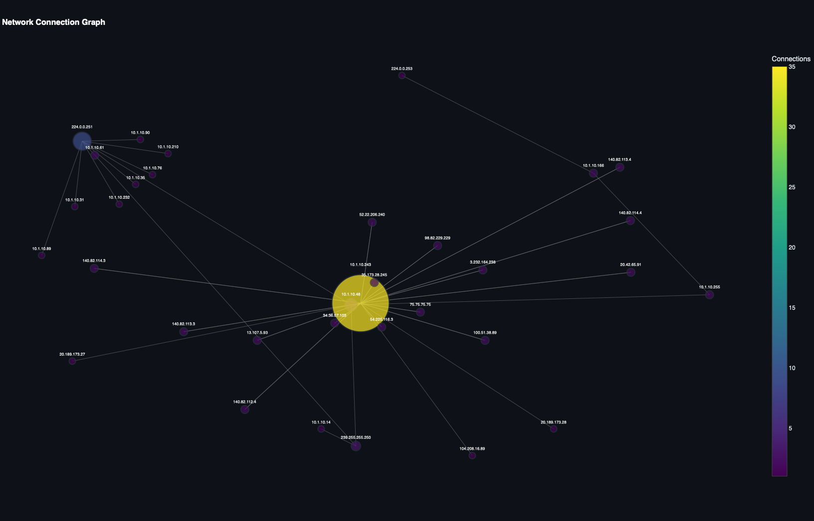
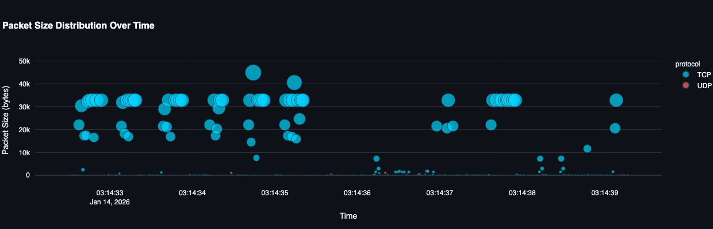
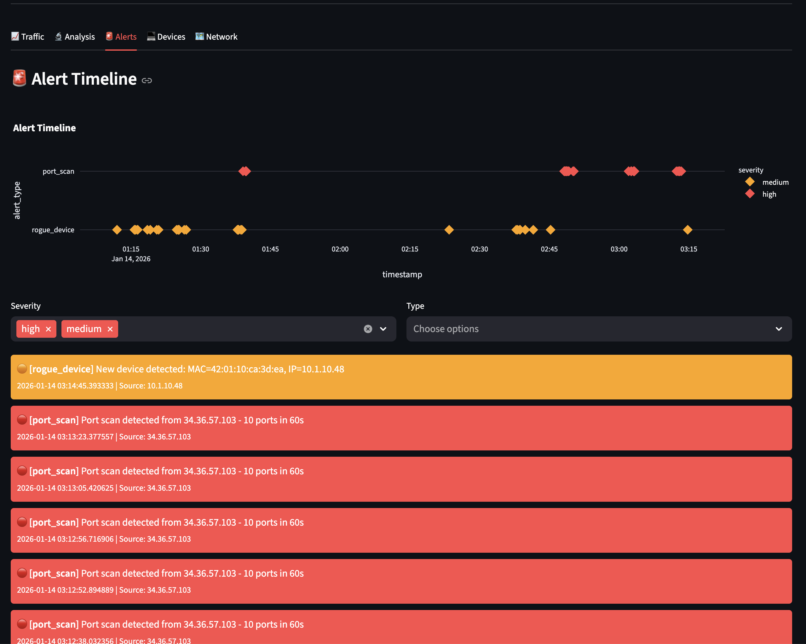

# Tandoori IDS

A lightweight, ML-powered Intrusion Detection System designed for small business networks. Built with Python, featuring real-time traffic analysis, machine learning anomaly detection, and a modern web dashboard.

## Features

### Real-Time Threat Detection
- **Port Scan Detection** - Identifies hosts scanning multiple ports
- **SSH Brute Force Detection** - Catches repeated authentication attempts
- **Rogue Device Alerts** - Detects unknown devices joining the network
- **ML Anomaly Detection** - Isolation Forest algorithm learns your network's normal behavior and flags unusual patterns

### Machine Learning
- Learns baseline traffic patterns specific to your network
- Detects anomalies based on:
  - Unusual traffic volumes
  - Strange connection times
  - Abnormal destination patterns
  - Port scanning behavior
- Self-training on historical data

### Web Dashboard
- Real-time traffic visualization
- Alert history with severity filtering
- Device inventory management
- Network health metrics
- Auto-refreshing interface

### Data Visualization
- **Plotly** - Interactive scatter plots, area charts, gauges, pie charts
- **Seaborn** - Heatmaps, correlation matrices
- **Matplotlib** - Statistical visualizations
- **NetworkX** - Network topology graphs

### Alerting
- Console alerts with severity levels
- Slack webhook integration
- SQLite database logging

## Architecture

```
┌─────────────────┐     ┌──────────────┐     ┌─────────────┐
│  Network Traffic │────▶│   ids.py     │────▶│  SQLite DB  │
│    (scapy)      │     │  (analyzer)  │     │  (storage)  │
└─────────────────┘     └──────┬───────┘     └──────┬──────┘
                               │                    │
                               ▼                    │
                        ┌──────────────┐            │
                        │ ml_detector  │            │
                        │ (Isolation   │            │
                        │   Forest)    │            │
                        └──────────────┘            │
                                                    │
                        ┌──────────────┐            │
                        │  dashboard   │◀───────────┘
                        │ (Streamlit)  │
                        └──────────────┘
```

## Installation

```bash
# Clone the repository
git clone https://github.com/niraj411/tandoori-ids.git
cd tandoori-ids

# Create virtual environment
python -m venv venv
source venv/bin/activate  # Linux/Mac
# or: venv\Scripts\activate  # Windows

# Install dependencies
pip install -r requirements.txt
```

## Configuration

Edit `config.py` to customize:

```python
# Network interface to monitor
INTERFACE = "eth0"

# Detection thresholds
PORT_SCAN_THRESHOLD = 10   # ports in 60 seconds
BRUTE_FORCE_THRESHOLD = 5  # attempts in 60 seconds

# Known devices (won't trigger rogue device alerts)
KNOWN_DEVICES = {
    "aa:bb:cc:dd:ee:ff": "My Server",
    "11:22:33:44:55:66": "POS Terminal",
}

# ML Settings
ML_CONTAMINATION = 0.05  # Expected anomaly rate (5%)
```

Set up Slack alerts (optional):
```bash
echo "SLACK_WEBHOOK=https://hooks.slack.com/services/YOUR/WEBHOOK/URL" > .env
```

## Usage

### 1. Start the IDS

```bash
sudo python ids.py
```

Output:
```
🛡️  Tandoori IDS Starting...
📡 Monitoring interface: eth0
⚙️  Port scan threshold: 10 ports/60s
⚙️  Brute force threshold: 5 attempts/60s
--------------------------------------------------
[ML] Initializing anomaly detection...
[ML] No trained model found. Collecting baseline data...
```

### 2. Train the ML Model

After collecting a few hours of normal traffic:

```bash
python ml_detector.py
```

Output:
```
Tandoori IDS - ML Anomaly Detector
----------------------------------------
[ML] Training on last 24 hours of traffic...
[ML] Trained on 1547 samples
[ML] Baseline: ~42 packets, ~15360 bytes per 5-min window
[ML] Model saved
```

### 3. Launch the Dashboard

```bash
streamlit run dashboard.py
```

Access at `http://localhost:8501`

## Screenshots

### Main Dashboard


### Traffic Analysis


### Network Topology Graph


### Weekly Traffic Heatmap


### Alert Timeline


---

## Dashboard Features

The dashboard provides five main tabs with rich visualizations:

### Traffic Tab
- **Area Chart** - Traffic volume over time
- **Pie Chart** - Protocol distribution (TCP/UDP)
- **Scatter Plot** - Packet size distribution with hover details
- **Bar Chart** - Top talkers by packet count

### Analysis Tab
- **Scatter Plot** - Port activity distribution
- **Gauge Chart** - Real-time packet rate vs average
- **Heatmap** - Weekly traffic patterns (day/hour)
- **Correlation Matrix** - Feature correlations (size, port, time)

### Alerts Tab
- **Timeline** - Scatter plot of alerts over time by severity
- **Pie Charts** - Alert breakdown by type and severity
- **Filterable Cards** - Detailed alert information

### Devices Tab
- **Inventory Table** - All discovered devices with status
- **Pie Chart** - Known vs unknown device ratio

### Network Tab
- **Graph Visualization** - Network topology using NetworkX
- **Connection Table** - Source/destination traffic pairs
- **ML Model Status** - Training metrics and baseline stats

## Alert Types

| Type | Severity | Description |
|------|----------|-------------|
| `port_scan` | High | Host scanning multiple ports |
| `brute_force` | High | Repeated SSH connection attempts |
| `rogue_device` | Medium | Unknown MAC address detected |
| `ml_anomaly` | Medium | ML-detected unusual behavior |

## Tech Stack

- **Python 3.8+**
- **Scapy** - Packet capture and analysis
- **Scikit-learn** - Isolation Forest for anomaly detection
- **Streamlit** - Web dashboard framework
- **SQLite** - Data persistence
- **Pandas/NumPy** - Data manipulation
- **Plotly** - Interactive visualizations
- **Matplotlib/Seaborn** - Statistical charts and heatmaps
- **NetworkX** - Graph analysis and visualization

## Project Structure

```
tandoori-ids/
├── ids.py           # Main IDS engine
├── ml_detector.py   # ML anomaly detection
├── dashboard.py     # Streamlit web UI
├── database.py      # SQLite operations
├── config.py        # Configuration
├── requirements.txt # Dependencies
└── README.md
```

## Extending

### Add Custom Detection Rules

Edit `ids.py` to add new detection logic in `packet_callback()`:

```python
# Example: Detect DNS tunneling (high volume DNS)
if UDP in packet and packet[UDP].dport == 53:
    # Your detection logic here
    pass
```

### Add New Dashboard Metrics

Edit `dashboard.py` to add visualizations using Streamlit components.

## Roadmap

- [ ] PCAP file replay for testing
- [ ] Email alerting
- [ ] GeoIP visualization
- [ ] Docker deployment
- [ ] REST API for integrations

## License

MIT License - See [LICENSE](LICENSE) for details.

## Author

https://rajgautam.com
Raj


Built for small business network security monitoring.
https://tandoorikitchenco.com/
---

*Named after the Tandoori Kitchen restaurant network it was originally designed to protect.*
